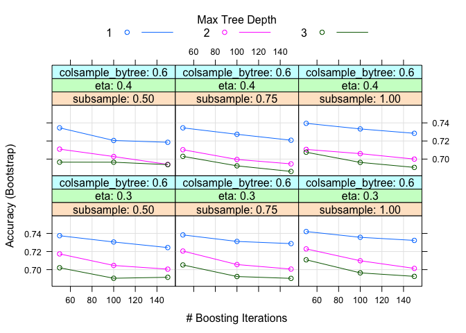
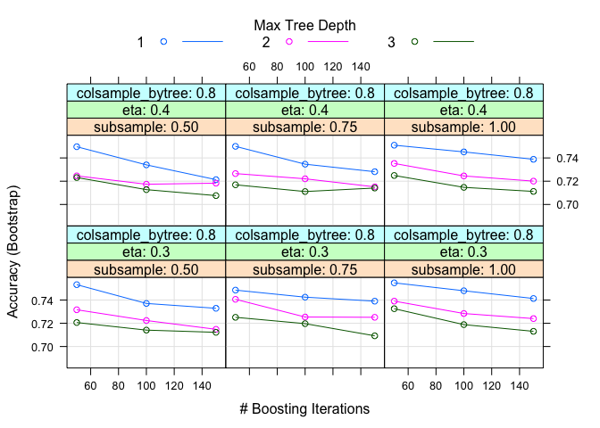

## Using Gradient Boosted Trees (xgbTree)

From **multiple-model.md(multiple-model.md)** analysis, it shows the xgbTree model best best performance with prediction accuracy of **0.761** on the testing dataset. We will extract the model from **multiple-model.md(multiple-model.md)** analysis and make the model package for it.


```r
load(file = "result/models-list.RData")
fit<-models.list$xgbTree
save(fit,file = "result/fit.rda")

## parameter tuned
fit$bestTune
```

```
##    nrounds max_depth eta gamma colsample_bytree min_child_weight subsample
## 16      50         1 0.3     0              0.8                1         1
```

```r
plot(fit)
```

<!-- --><!-- -->


