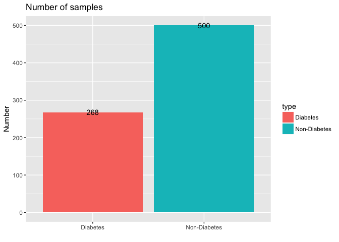
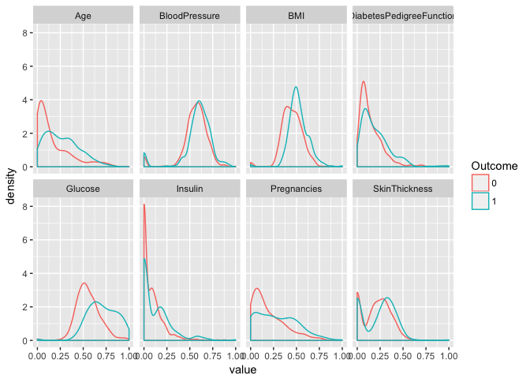
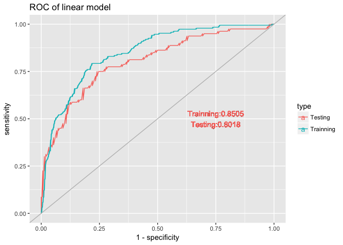

## Load Data

We will use [ProjectTemplate](http://projecttemplate.net/) to layout my project. When load the project, we will split the **diabetes** dataset into train and test dataset, namely **trainDat** (70%) and **testDat**(remaining 30%).


```r
library(ProjectTemplate)
load.project()
ls()
```

```
## [1] "config"       "diabetes"     "project.info" "testDat"     
## [5] "trainDat"
```

The mung code to read the csv files and split it into trainning (**trainDat**) and testing(**testDat**) dataset is located in **GDM/munge/01-A.R**. Code is listed below


```r
# Example preprocessing script.

## split the diabetes dataset into train and test ##
set.seed(1)
diabetes$Outcome = as.factor(diabetes$Outcome)
inTrain <- createDataPartition(diabetes$Outcome, p = 0.70 , list = FALSE)
trainDat <- diabetes[ inTrain, ]
testDat <- diabetes[ -inTrain, ]
rm(inTrain
```


## Explanatory analysis

### What are the features

There are 8 features in the dataset

```r
library(tidyverse)
glimpse(diabetes)
```

```
## Observations: 768
## Variables: 9
## $ Pregnancies              <int> 6, 1, 8, 1, 0, 5, 3, 10, 2, 8, 4, 10,...
## $ Glucose                  <int> 148, 85, 183, 89, 137, 116, 78, 115, ...
## $ BloodPressure            <int> 72, 66, 64, 66, 40, 74, 50, 0, 70, 96...
## $ SkinThickness            <int> 35, 29, 0, 23, 35, 0, 32, 0, 45, 0, 0...
## $ Insulin                  <int> 0, 0, 0, 94, 168, 0, 88, 0, 543, 0, 0...
## $ BMI                      <dbl> 33.6, 26.6, 23.3, 28.1, 43.1, 25.6, 3...
## $ DiabetesPedigreeFunction <dbl> 0.627, 0.351, 0.672, 0.167, 2.288, 0....
## $ Age                      <int> 50, 31, 32, 21, 33, 30, 26, 29, 53, 5...
## $ Outcome                  <fct> 1, 0, 1, 0, 1, 0, 1, 0, 1, 1, 0, 1, 0...
```

### Number of positive and negative samples

**268** samples have diabetes(positive) while **500** samples don't have diabetes (negatove)


```r
diabetes %>%
  count(Outcome) %>%
  mutate(type = ifelse(Outcome==1,"Diabetes","Non-Diabetes")) %>%
  ggplot(aes(type,n,fill=type)) + 
    geom_bar(stat="identity")+
    geom_text(aes(label=n))+
    xlab("")+ylab("Number")+
    ggtitle("Number of samples")
```

<!-- -->


### Look at each feature's distribution between positives and negatives

**Will first normalize each feature's value into [0,1] ranges**


```r
## Scale to 0,1
scale.0.1 <-function(x){
  (x-min(x))/(max(x)-min(x))
}

diabetes %>%
  mutate_each(funs(scale.0.1),-Outcome) %>%
  gather(key=feature,value = value,-Outcome) %>%
  ggplot(aes(value,color=Outcome))+
    geom_density()+
    facet_wrap(~feature,ncol=4)
```

<!-- -->


## Linear Model performance

### Use all features

- The AUC on training and testing is 0.852 and 0.802 separately.
- It looks the trainning dataset is not over fitting


```r
## Will train model on the trainDat
model.linear = glm(Outcome~.,data = trainDat,family = "binomial")
summary(model.linear)
```

```
## 
## Call:
## glm(formula = Outcome ~ ., family = "binomial", data = trainDat)
## 
## Deviance Residuals: 
##     Min       1Q   Median       3Q      Max  
## -2.6732  -0.7129  -0.3894   0.6993   3.0115  
## 
## Coefficients:
##                            Estimate Std. Error z value Pr(>|z|)    
## (Intercept)              -8.6270929  0.8832061  -9.768  < 2e-16 ***
## Pregnancies               0.1198537  0.0386093   3.104  0.00191 ** 
## Glucose                   0.0369678  0.0045852   8.062 7.48e-16 ***
## BloodPressure            -0.0192598  0.0064575  -2.983  0.00286 ** 
## SkinThickness            -0.0020655  0.0084715  -0.244  0.80737    
## Insulin                  -0.0002562  0.0011213  -0.228  0.81928    
## BMI                       0.1024755  0.0192329   5.328 9.92e-08 ***
## DiabetesPedigreeFunction  0.7386146  0.3604482   2.049  0.04045 *  
## Age                       0.0176736  0.0113199   1.561  0.11846    
## ---
## Signif. codes:  0 '***' 0.001 '**' 0.01 '*' 0.05 '.' 0.1 ' ' 1
## 
## (Dispersion parameter for binomial family taken to be 1)
## 
##     Null deviance: 696.28  on 537  degrees of freedom
## Residual deviance: 492.44  on 529  degrees of freedom
## AIC: 510.44
## 
## Number of Fisher Scoring iterations: 5
```

```r
## Look performance on the trainning and test dataset

pf.test <- testDat %>%
  select(Outcome) %>%
  mutate(predicted.prob = predict(model.linear,testDat,type="response"),
         dataset = "Test")

pf.train <- trainDat %>%
  select(Outcome) %>%
  mutate(predicted.prob = predict(model.linear,trainDat,type="response"),
         dataset = "Train")

### 
library(pROC)
ROC.train <- roc(pf.train$Outcome,pf.train$predicted.prob )
ROC.test <- roc(pf.test$Outcome,pf.test$predicted.prob )

# Plot the ROC curve
sp.se = data_frame(specificity = c(ROC.train$specificities,ROC.test$specificities),
                   sensitivity = c(ROC.train$sensitivities,ROC.test$sensitivities),
                   type = c(rep("Trainning",length(ROC.train$specificities)),
                            rep("Testing",length(ROC.test$specificities)))
)

cat("Linear Model performance (AUC)")
```

```
## Linear Model performance (AUC)
```

```r
(model.auc = data_frame(AUC = c(auc(ROC.train),auc(ROC.test)),
                       type=c("Trainning","Testing")))
```

```
## # A tibble: 2 x 2
##     AUC type     
##   <dbl> <chr>    
## 1 0.852 Trainning
## 2 0.802 Testing
```

```r
model.auc.text <- model.auc %>%
        transmute(auc=paste(type,round(AUC,4),sep=":")) %>%
        as.data.frame()

model.auc.text = paste( model.auc.text[,1],collapse = "\n")

save(model.auc,file ="result/model.auc.linear.Rda")
ggplot(sp.se,aes(x = 1-specificity,y=sensitivity,color=type))+
    geom_line() +
    geom_abline(slope = 1,color='grey')+
    ggtitle("ROC of linear model")+
    geom_text(aes(x=.75,y=.5,label=model.auc.text))
```

<!-- -->


### Use a subset of features

- Use only features of **Pregnancies**, **Glucose**, **BloodPressure** ,**DiabetesPedigreeFunction** and **BMI**
- The AUC on training and testing is 0.850 and 0.802 separately - **Using 5 features doesn't decrease the performance**


```r
## Will train model on the trainDat
model.linear2 = trainDat %>%
  select(Pregnancies,Glucose,BloodPressure,BMI,DiabetesPedigreeFunction,Outcome) %>%
  glm(Outcome~.,data = .,family = "binomial")
summary(model.linear2)
```

```
## 
## Call:
## glm(formula = Outcome ~ ., family = "binomial", data = .)
## 
## Deviance Residuals: 
##     Min       1Q   Median       3Q      Max  
## -2.8035  -0.7242  -0.3849   0.6970   3.0722  
## 
## Coefficients:
##                           Estimate Std. Error z value Pr(>|z|)    
## (Intercept)              -8.293585   0.846877  -9.793  < 2e-16 ***
## Pregnancies               0.153255   0.033562   4.566 4.96e-06 ***
## Glucose                   0.038198   0.004276   8.932  < 2e-16 ***
## BloodPressure            -0.018002   0.006193  -2.907  0.00365 ** 
## BMI                       0.097506   0.017983   5.422 5.89e-08 ***
## DiabetesPedigreeFunction  0.750158   0.353502   2.122  0.03383 *  
## ---
## Signif. codes:  0 '***' 0.001 '**' 0.01 '*' 0.05 '.' 0.1 ' ' 1
## 
## (Dispersion parameter for binomial family taken to be 1)
## 
##     Null deviance: 696.28  on 537  degrees of freedom
## Residual deviance: 495.50  on 532  degrees of freedom
## AIC: 507.5
## 
## Number of Fisher Scoring iterations: 5
```

```r
## Look performance on the trainning and test dataset

pf.test2 <- testDat %>%
  select(Outcome) %>%
  mutate(predicted.prob = predict(model.linear2,testDat,type="response"),
         dataset = "Test")

pf.train2 <- trainDat %>%
  select(Outcome) %>%
  mutate(predicted.prob = predict(model.linear2,trainDat,type="response"),
         dataset = "Train")

### 
ROC.train2 <- roc(pf.train2$Outcome,pf.train2$predicted.prob )
ROC.test2 <- roc(pf.test2$Outcome,pf.test2$predicted.prob )

# Plot the ROC curve
sp.se = data_frame(specificity = c(ROC.train2$specificities,ROC.test2$specificities),
                   sensitivity = c(ROC.train2$sensitivities,ROC.test2$sensitivities),
                   type = c(rep("Trainning",length(ROC.train2$specificities)),
                            rep("Testing",length(ROC.test2$specificities)))
)

cat("Linear Model performance (AUC)")
```

```
## Linear Model performance (AUC)
```

```r
(model.auc = data_frame(AUC = c(auc(ROC.train2),auc(ROC.test2)),
                       type=c("Trainning","Testing")))
```

```
## # A tibble: 2 x 2
##     AUC type     
##   <dbl> <chr>    
## 1 0.850 Trainning
## 2 0.802 Testing
```

```r
model.auc.text <- model.auc %>%
        transmute(auc=paste(type,round(AUC,4),sep=":")) %>%
        as.data.frame()

model.auc.text = paste( model.auc.text[,1],collapse = "\n")

ggplot(sp.se,aes(x = 1-specificity,y=sensitivity,color=type))+
    geom_line() +
    geom_abline(slope = 1,color='grey')+
    ggtitle("ROC of linear model")+
    geom_text(aes(x=.75,y=.5,label=model.auc.text))
```

<!-- -->


