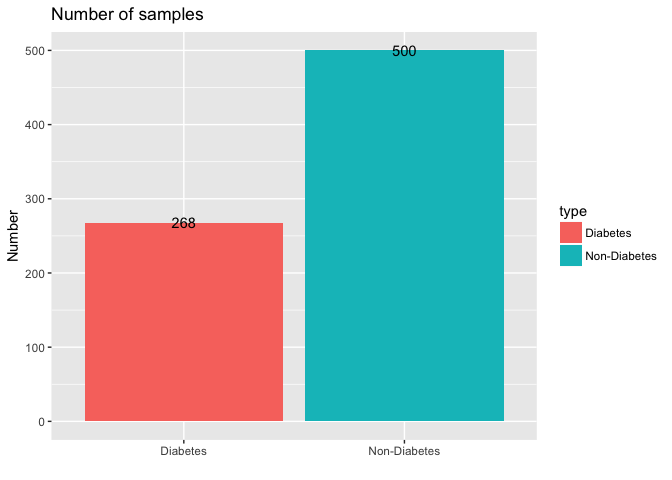
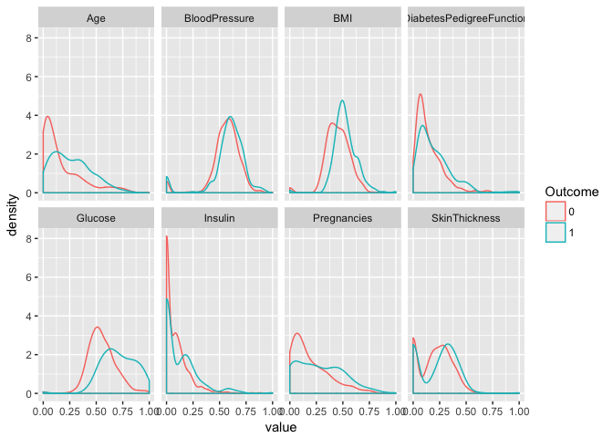
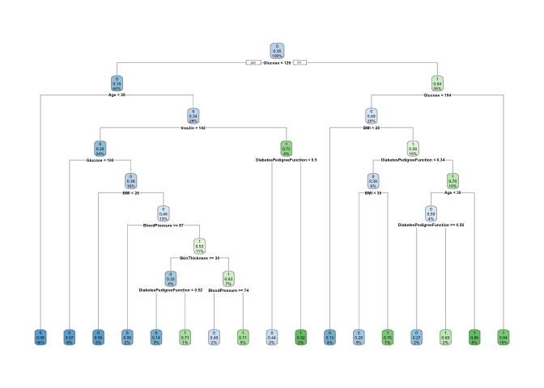
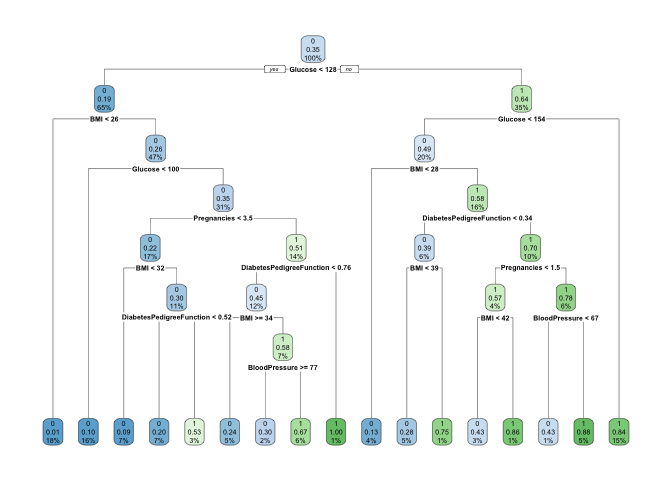
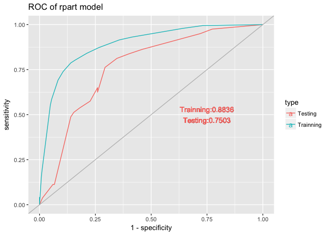

## Load Data

We will use [ProjectTemplate](http://projecttemplate.net/) to layout my project. When load the project, we will split the **diabetes** dataset into train and test dataset, namely **trainDat** (70%) and **testDat**(remaining 30%).


```r
library(ProjectTemplate)
load.project()
ls()
```

```
## [1] "config"          "diabetes"        "helper.function" "project.info"   
## [5] "testDat"         "trainDat"
```

The mung code to read the csv files and split it into trainning (**trainDat**) and testing(**testDat**) dataset is located in **GDM/munge/01-A.R**. Code is listed below


```r
# Example preprocessing script.

## split the diabetes dataset into train and test ##
set.seed(1)
diabetes$Outcome = as.factor(diabetes$Outcome)
inTrain <- createDataPartition(diabetes$Outcome, p = 0.70 , list = FALSE)
trainDat <- diabetes[ inTrain, ]
testDat <- diabetes[ -inTrain, ]
rm(inTrain
```


## Explanatory analysis

### What are the features

There are 8 features in the dataset

```r
library(tidyverse)
glimpse(diabetes)
```

```
## Observations: 768
## Variables: 9
## $ Pregnancies              <int> 6, 1, 8, 1, 0, 5, 3, 10, 2, 8, 4, 10,...
## $ Glucose                  <int> 148, 85, 183, 89, 137, 116, 78, 115, ...
## $ BloodPressure            <int> 72, 66, 64, 66, 40, 74, 50, 0, 70, 96...
## $ SkinThickness            <int> 35, 29, 0, 23, 35, 0, 32, 0, 45, 0, 0...
## $ Insulin                  <int> 0, 0, 0, 94, 168, 0, 88, 0, 543, 0, 0...
## $ BMI                      <dbl> 33.6, 26.6, 23.3, 28.1, 43.1, 25.6, 3...
## $ DiabetesPedigreeFunction <dbl> 0.627, 0.351, 0.672, 0.167, 2.288, 0....
## $ Age                      <int> 50, 31, 32, 21, 33, 30, 26, 29, 53, 5...
## $ Outcome                  <fct> 1, 0, 1, 0, 1, 0, 1, 0, 1, 1, 0, 1, 0...
```

### Number of positive and negative samples

**268** samples have diabetes(positive) while **500** samples don't have diabetes (negatove)


```r
diabetes %>%
  count(Outcome) %>%
  mutate(type = ifelse(Outcome==1,"Diabetes","Non-Diabetes")) %>%
  ggplot(aes(type,n,fill=type)) + 
    geom_bar(stat="identity")+
    geom_text(aes(label=n))+
    xlab("")+ylab("Number")+
    ggtitle("Number of samples")
```

<!-- -->


### Look at each feature's distribution between positives and negatives

**Will first normalize each feature's value into [0,1] ranges**


```r
## Scale to 0,1
scale.0.1 <-function(x){
  (x-min(x))/(max(x)-min(x))
}

diabetes %>%
  mutate_each(funs(scale.0.1),-Outcome) %>%
  gather(key=feature,value = value,-Outcome) %>%
  ggplot(aes(value,color=Outcome))+
    geom_density()+
    facet_wrap(~feature,ncol=4)
```

<!-- -->


## Tree Model performance

### Use all features

- The AUC on training and testing is 0.884 and 0.750 separately.
- It looks the data is over fitting on the trainning set


```r
## Will train model on the trainDat
library(rpart)
model.rpart = rpart(Outcome~.,data = trainDat,method = "class", control = rpart.control(cp = 0))

library(rpart.plot)
rpart.plot(model.rpart)
```

<!-- -->

```r
#summary(model.rpart)

## Look performance on the trainning and test dataset
pf.test <- testDat %>%
  select(Outcome) %>%
  mutate(predicted.prob = predict(model.rpart,testDat,type="prob")[,2],
         predicted = predict(model.rpart,testDat,type="class"),
         dataset = "Test")

pf.train <- trainDat %>%
  select(Outcome) %>%
  mutate(predicted.prob = predict(model.rpart,trainDat,type="prob")[,2],
          predicted = predict(model.rpart,trainDat,type="class"),
         dataset = "Train")

### 
library(pROC)
ROC.train <- roc(pf.train$Outcome,pf.train$predicted.prob )
ROC.test <- roc(pf.test$Outcome,pf.test$predicted.prob )

# Plot the ROC curve
sp.se = data_frame(specificity = c(ROC.train$specificities,ROC.test$specificities),
                   sensitivity = c(ROC.train$sensitivities,ROC.test$sensitivities),
                   type = c(rep("Trainning",length(ROC.train$specificities)),
                            rep("Testing",length(ROC.test$specificities)))
)

cat("rpart Model performance (AUC)")
```

```
## rpart Model performance (AUC)
```

```r
(model.auc = data_frame(AUC = c(auc(ROC.train),auc(ROC.test)),
                       type=c("Trainning","Testing")))
```

```
## # A tibble: 2 x 2
##     AUC type     
##   <dbl> <chr>    
## 1 0.884 Trainning
## 2 0.750 Testing
```

```r
model.auc.text <- model.auc %>%
        transmute(auc=paste(type,round(AUC,4),sep=":")) %>%
        as.data.frame()

model.auc.text = paste( model.auc.text[,1],collapse = "\n")
                

save(model.auc,file ="model.auc.rpart.Rda")
ggplot(sp.se,aes(x = 1-specificity,y=sensitivity,color=type))+
    geom_line() +
    geom_abline(slope = 1,color='grey')+
    ggtitle("ROC of rpart model") +
    geom_text(aes(x=.75,y=.5,label=model.auc.text))
```

<!-- -->


### Use a subset of features

- Use only features of **Pregnancies**, **Glucose**, **BloodPressure** ,**DiabetesPedigreeFunction** and **BMI**
- The AUC on training and testing is 0.892 and 0.764 separately - **Using 5 features Increase the performance**
- It looks over fitting on the trainning dataset


```r
## Will train model on the trainDat
model.rpart2 = trainDat %>%
  select(Pregnancies,Glucose,BloodPressure,BMI,DiabetesPedigreeFunction,Outcome) %>%
  rpart(Outcome~.,data = .,method = "class", control = rpart.control(cp = 0))

rpart.plot(model.rpart2)
```

<!-- -->

```r
#summary(model.rpart2)

## Look performance on the trainning and test dataset

pf.test2 <- testDat %>%
  select(Outcome) %>%
  mutate(predicted.prob = predict(model.rpart2,testDat,type="prob")[,2],
         predicted = predict(model.rpart2,testDat,type="class"),
         dataset = "Test")

pf.train2 <- trainDat %>%
  select(Outcome) %>%
  mutate(predicted.prob = predict(model.rpart2,trainDat,type="prob")[,2],
          predicted = predict(model.rpart2,trainDat,type="class"),
         dataset = "Train")

### 
ROC.train2 <- roc(pf.train2$Outcome,pf.train2$predicted.prob )
ROC.test2 <- roc(pf.test2$Outcome,pf.test2$predicted.prob )

# Plot the ROC curve
sp.se = data_frame(specificity = c(ROC.train2$specificities,ROC.test2$specificities),
                   sensitivity = c(ROC.train2$sensitivities,ROC.test2$sensitivities),
                   type = c(rep("Trainning",length(ROC.train2$specificities)),
                            rep("Testing",length(ROC.test2$specificities)))
)

cat("rpart Model performance (AUC)")
```

```
## rpart Model performance (AUC)
```

```r
(model.auc = data_frame(AUC = c(auc(ROC.train2),auc(ROC.test2)),
                       type=c("Trainning","Testing")))
```

```
## # A tibble: 2 x 2
##     AUC type     
##   <dbl> <chr>    
## 1 0.892 Trainning
## 2 0.764 Testing
```

```r
ggplot(sp.se,aes(x = 1-specificity,y=sensitivity,color=type))+
    geom_line() +
    geom_abline(slope = 1,color='grey')+
    ggtitle("ROC of rpart model") +
    geom_text(aes(x=.75,y=.5,label=model.auc.text))
```

<!-- -->


