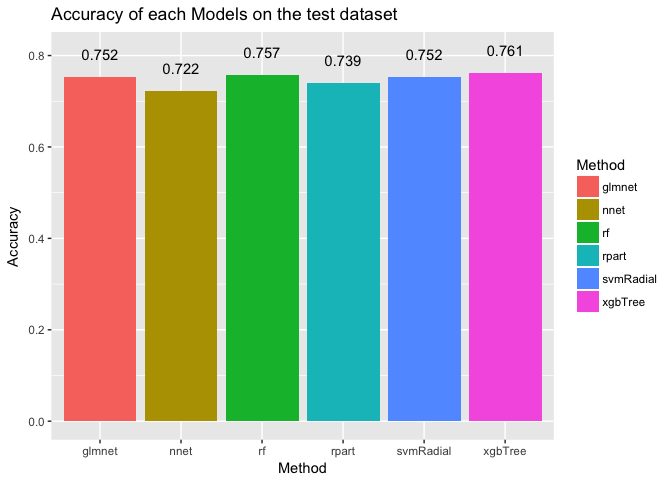

## Load Data

We will use [ProjectTemplate](http://projecttemplate.net/) to layout my project. When load the project, we will split the **diabetes** dataset into train and test dataset, namely **trainDat** (70%) and **testDat**(remaining 30%).


```r
library(ProjectTemplate)
load.project()
ls()
```

```
## [1] "config"       "diabetes"     "project.info" "testDat"     
## [5] "trainDat"
```

The mung code to read the csv files and split it into trainning (**trainDat**) and testing(**testDat**) dataset is located in **GDM/munge/01-A.R**. Code is listed below


```r
# Example preprocessing script.

## split the diabetes dataset into train and test ##
set.seed(1)
diabetes$Outcome = as.factor(diabetes$Outcome)
inTrain <- createDataPartition(diabetes$Outcome, p = 0.70 , list = FALSE)
trainDat <- diabetes[ inTrain, ]
testDat <- diabetes[ -inTrain, ]
rm(inTrain)
```


## Performance on different models

We will apply **[caret](http://topepo.github.io/caret/index.html)** to test a series of models on the training dataset using **bootstrap(boot)** method to tune the parameters and get the performance on the testing dataset.


The models will be tested are:

- Linear model (**glmnet**)
- Decision tree (**rpart**)
- Neural Networks (**nnet**)
- RandomForest  (**rf**)
- SVM   (**svmRadial**)
- Gradient Boosted Trees (**xgbTree**)


```r
library(caret)

model.names = c("glmnet","rpart","nnet","rf","svmRadial","xgbTree")
names(model.names) = c("Generalized Linear Model","Decision Tree","Neural Networks","RandomForest","SVM","Gradient Boosted Trees")
models.list = vector("list",length(model.names))
names(models.list) = model.names

for( i in 1:length(model.names)){
  cat("[",date(),"] Trainning Model - ",names(model.names)[i],"(",model.names[i],")\n")
  
  set.seed(123)
  if(model.names[i]=="nnet"){
    models.list[[i]] <-train(Outcome~.,
                data = trainDat,
                method=model.names[i],
                ## This parameter only works for nnet to turn off message
                trace=FALSE)  ## Default boot resampling
  }else{
    models.list[[i]] <-train(Outcome~.,
                data = trainDat,
                method=model.names[i]) ## Default boot resampling

  }
}
```

```
## [ Tue May  8 00:56:54 2018 ] Trainning Model -  Generalized Linear Model ( glmnet )
## [ Tue May  8 00:56:57 2018 ] Trainning Model -  Decision Tree ( rpart )
## [ Tue May  8 00:56:58 2018 ] Trainning Model -  Neural Networks ( nnet )
## [ Tue May  8 00:57:06 2018 ] Trainning Model -  RandomForest ( rf )
## [ Tue May  8 00:57:28 2018 ] Trainning Model -  SVM ( svmRadial )
## [ Tue May  8 00:57:32 2018 ] Trainning Model -  Gradient Boosted Trees ( xgbTree )
```

```r
save(models.list,file = "result/models-list.RData")
```

- **Gradient Boosted Trees** has the best performance while **Neural Network** has the least performance


```r
library(tidyverse)
## Get accuracy on the test dataset
performance.list<-lapply(models.list, function(model){
  confusionMatrix(predict(model,testDat),testDat$Outcome)
})

lapply(performance.list,function(x) x$overall[1]) %>%
                as.data.frame() %>% t() %>% as.data.frame() %>%
                mutate(Method = rownames(.)) %>%
  ggplot(aes(x=Method,y=Accuracy,fill=Method)) +
    geom_bar(stat="identity")+
    geom_text(aes(y=Accuracy+0.05,label=round(Accuracy,3)))+
    ggtitle("Accuracy of each Models on the test dataset")
```

<!-- -->


