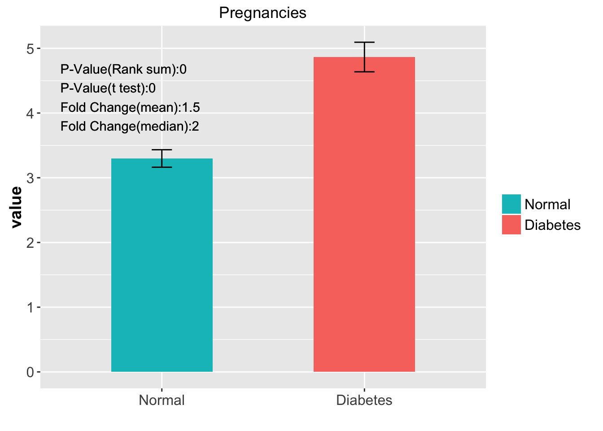
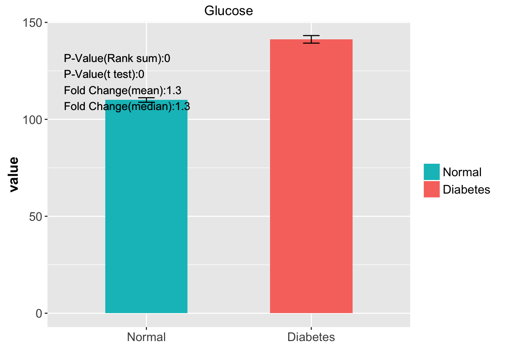
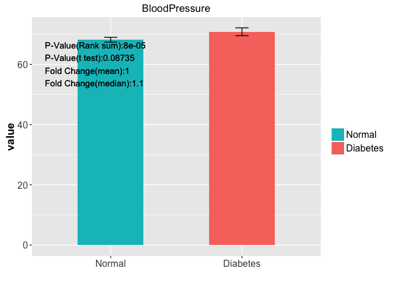
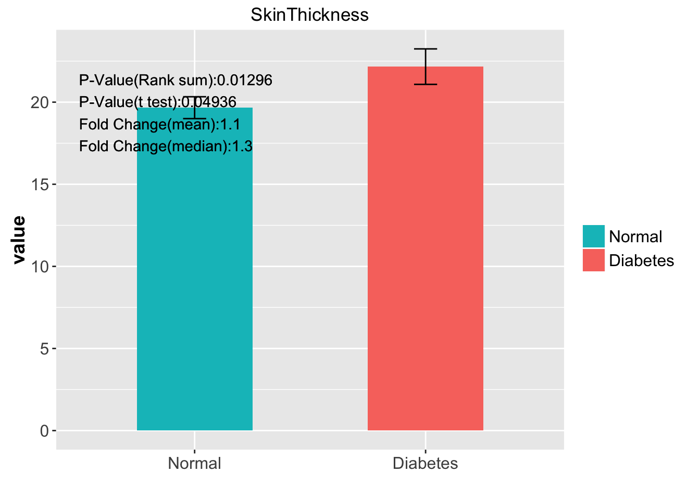
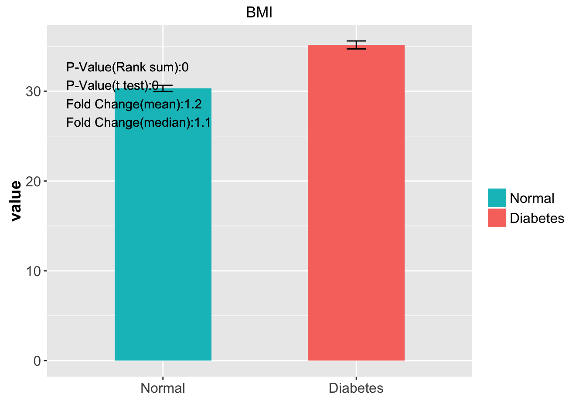
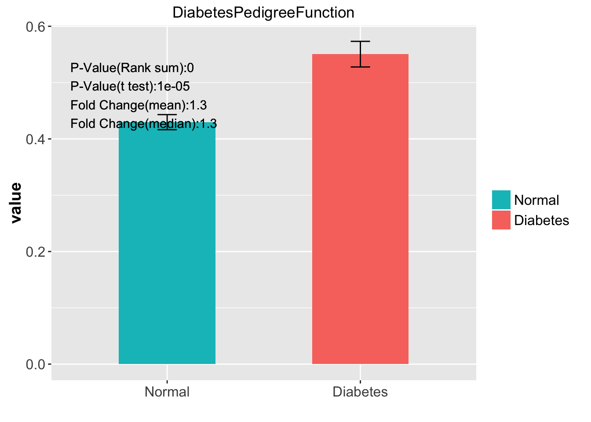
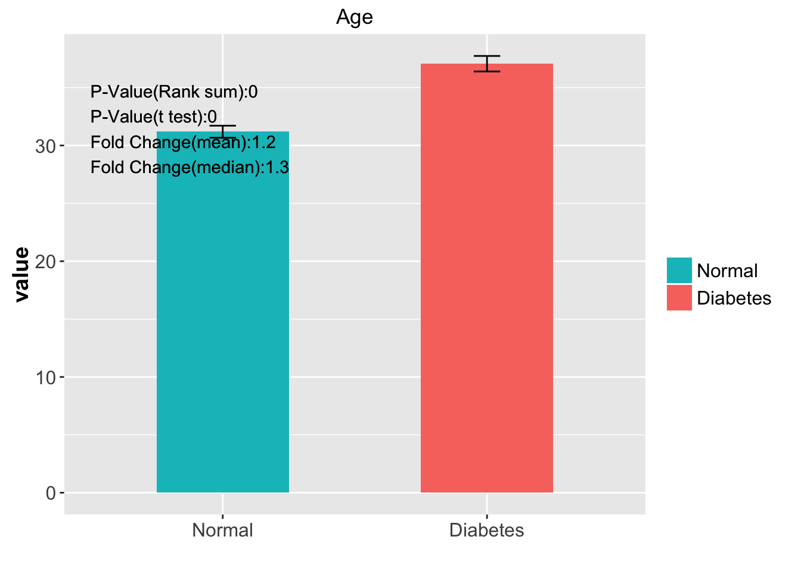

# Project Performance
Jiang Li  
`r Sys.Date()`  


## Load Data

We will use [ProjectTemplate](http://projecttemplate.net/) to layout my project. When load the project, we will split the **diabetes** dataset into train and test dataset, namely **trainDat** (70%) and **testDat**(remaining 30%).


```r
library(ProjectTemplate)
load.project()
ls()
```

```
## [1] "config"          "diabetes"        "helper.function" "project.info"   
## [5] "testDat"         "trainDat"
```

## Explore data

In this analysis, we will look at each feature to test whether the average (median) value is different between diabetes patients and normal people. We would apply both t-test(**t.test**) and Wilcoxon Rank Sum (**wilcox.test**).


```r
head(diabetes)
```

<div data-pagedtable="false">
  <script data-pagedtable-source type="application/json">
{"columns":[{"label":["Pregnancies"],"name":[1],"type":["int"],"align":["right"]},{"label":["Glucose"],"name":[2],"type":["int"],"align":["right"]},{"label":["BloodPressure"],"name":[3],"type":["int"],"align":["right"]},{"label":["SkinThickness"],"name":[4],"type":["int"],"align":["right"]},{"label":["Insulin"],"name":[5],"type":["int"],"align":["right"]},{"label":["BMI"],"name":[6],"type":["dbl"],"align":["right"]},{"label":["DiabetesPedigreeFunction"],"name":[7],"type":["dbl"],"align":["right"]},{"label":["Age"],"name":[8],"type":["int"],"align":["right"]},{"label":["Outcome"],"name":[9],"type":["fctr"],"align":["left"]}],"data":[{"1":"6","2":"148","3":"72","4":"35","5":"0","6":"33.6","7":"0.627","8":"50","9":"1"},{"1":"1","2":"85","3":"66","4":"29","5":"0","6":"26.6","7":"0.351","8":"31","9":"0"},{"1":"8","2":"183","3":"64","4":"0","5":"0","6":"23.3","7":"0.672","8":"32","9":"1"},{"1":"1","2":"89","3":"66","4":"23","5":"94","6":"28.1","7":"0.167","8":"21","9":"0"},{"1":"0","2":"137","3":"40","4":"35","5":"168","6":"43.1","7":"2.288","8":"33","9":"1"},{"1":"5","2":"116","3":"74","4":"0","5":"0","6":"25.6","7":"0.201","8":"30","9":"0"}],"options":{"columns":{"min":{},"max":[10]},"rows":{"min":[10],"max":[10]},"pages":{}}}
  </script>
</div>

```r
source("src/explore.R")
```

<!-- --><!-- --><!-- --><!-- --><!-- --><!-- --><!-- --><!-- -->


## Naive Bayes

We only get **78%** and **73%** accuracy on the tain and test dataset.


```r
source("src/funs.R")
get.performance(trainDat,trainDat,algo = "nb")
```

```
## Confusion Matrix and Statistics
## 
##           Reference
## Prediction   0   1
##          0 298  66
##          1  52 122
##                                           
##                Accuracy : 0.7807          
##                  95% CI : (0.7433, 0.8149)
##     No Information Rate : 0.6506          
##     P-Value [Acc > NIR] : 3.515e-11       
##                                           
##                   Kappa : 0.5091          
##  Mcnemar's Test P-Value : 0.2314          
##                                           
##             Sensitivity : 0.8514          
##             Specificity : 0.6489          
##          Pos Pred Value : 0.8187          
##          Neg Pred Value : 0.7011          
##              Prevalence : 0.6506          
##          Detection Rate : 0.5539          
##    Detection Prevalence : 0.6766          
##       Balanced Accuracy : 0.7502          
##                                           
##        'Positive' Class : 0               
## 
```

```r
get.performance(trainDat,testDat,algo = "nb")
```

```
## Confusion Matrix and Statistics
## 
##           Reference
## Prediction   0   1
##          0 123  35
##          1  27  45
##                                           
##                Accuracy : 0.7304          
##                  95% CI : (0.6682, 0.7866)
##     No Information Rate : 0.6522          
##     P-Value [Acc > NIR] : 0.006878        
##                                           
##                   Kappa : 0.3916          
##  Mcnemar's Test P-Value : 0.374003        
##                                           
##             Sensitivity : 0.8200          
##             Specificity : 0.5625          
##          Pos Pred Value : 0.7785          
##          Neg Pred Value : 0.6250          
##              Prevalence : 0.6522          
##          Detection Rate : 0.5348          
##    Detection Prevalence : 0.6870          
##       Balanced Accuracy : 0.6912          
##                                           
##        'Positive' Class : 0               
## 
```


